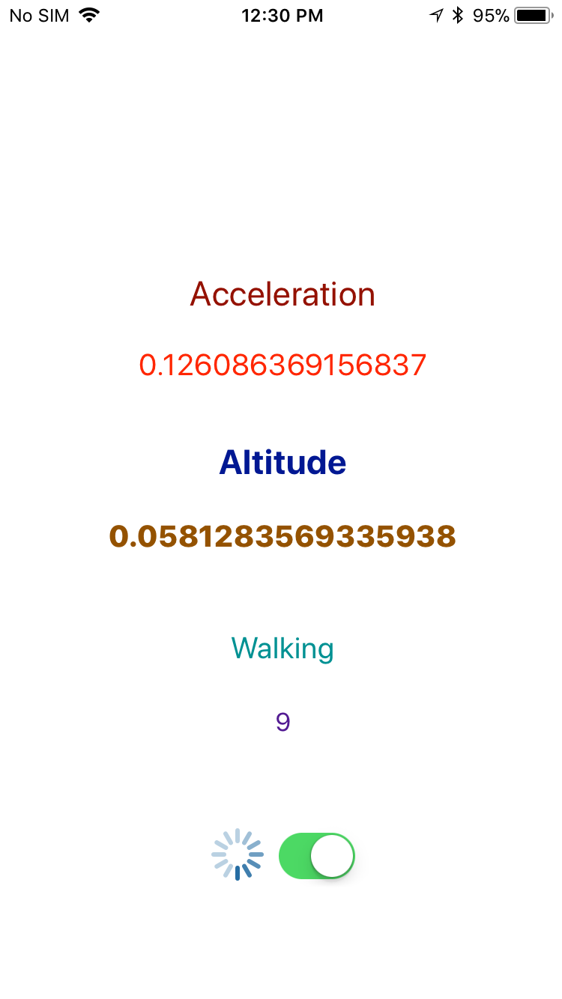
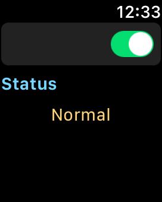
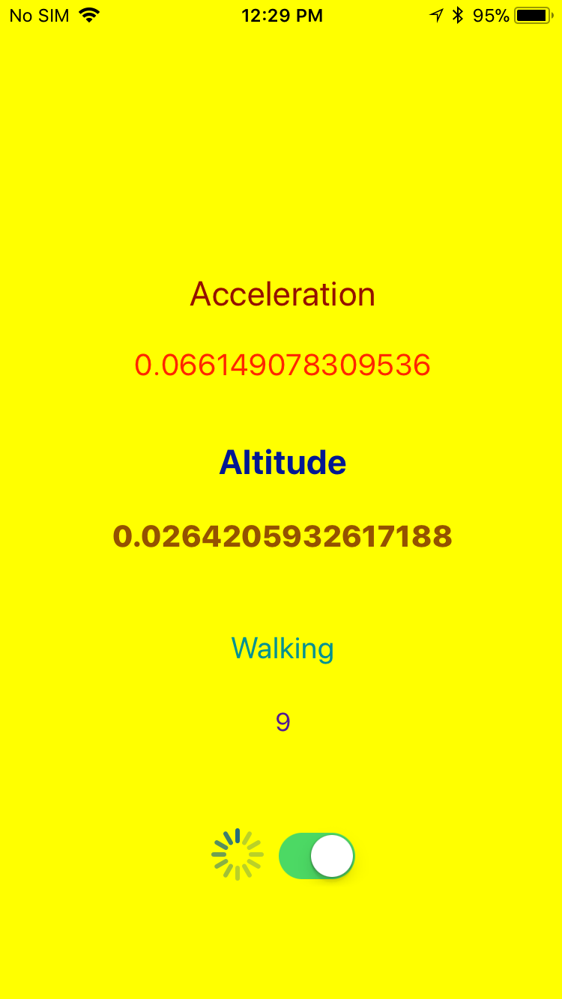
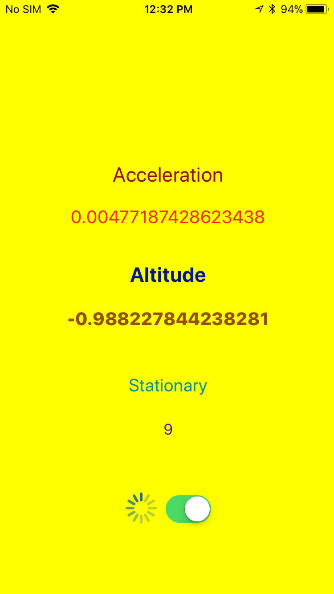
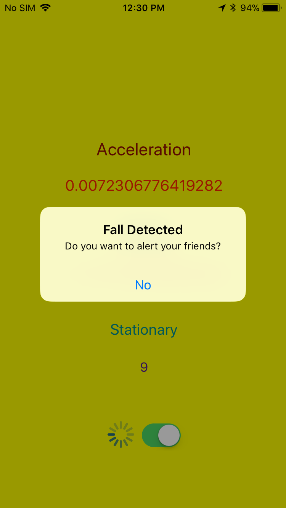
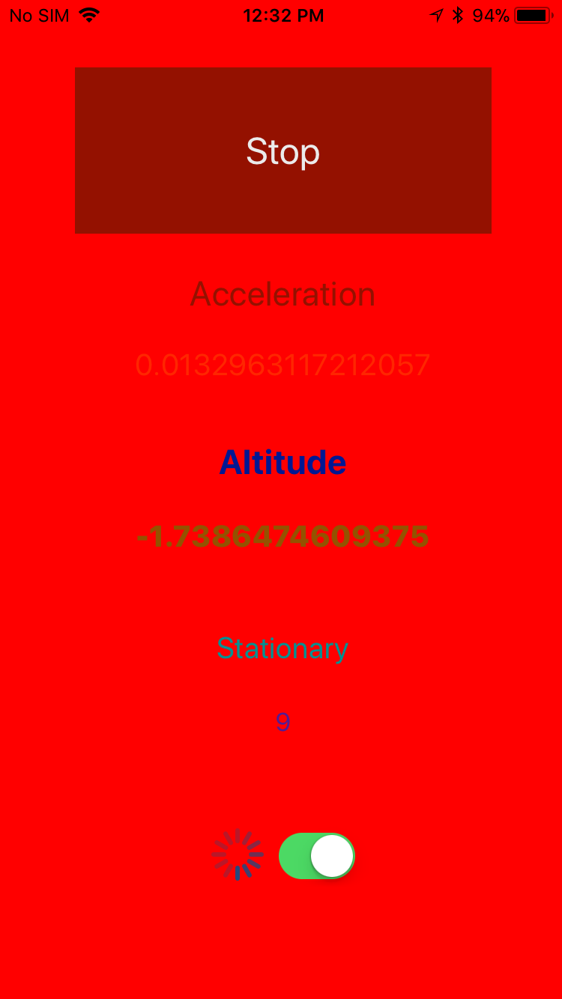
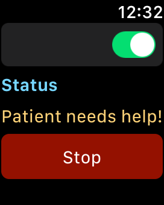
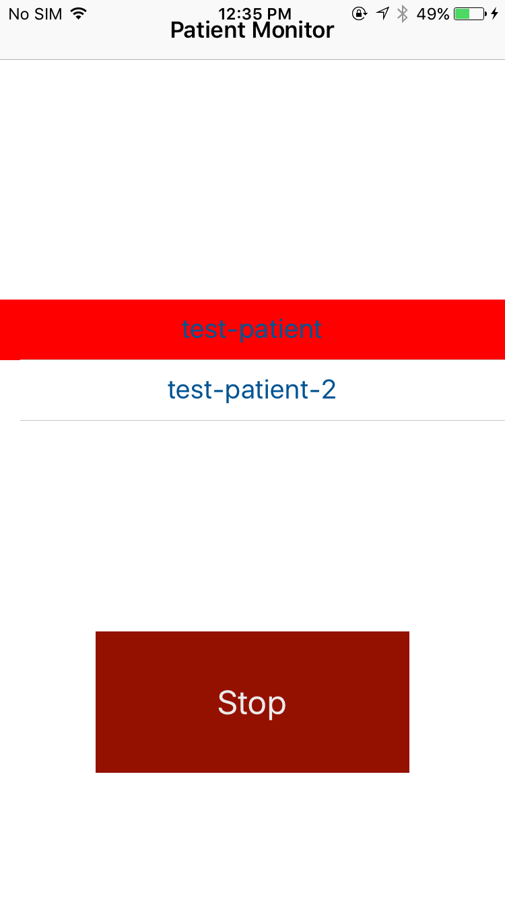

# Fall Detection
This repository contains an early implementation iteration to detect fall in patients suffering from dementia. The system
aims to alert the registered users immediately to bring help to the patient.  

## Devices
* Apple Watch Series 1
* iPhone

## Sensors
The sensors used in the implementation are embedded in an iPhone itself.
* Accelerometer
* Altimeter
* Pedometer
* Speaker

## Frameworks
* CoreLocation
* CoreMotion
* AVFoundation

## Working Details
- The iPhone continuously records user acceleration, relative altitude and motion activity.
- Once a set of a number of enqueued user acceleration values exceed the threshold count, the system goes into a warning state.
- The system sends alert to the patient's apple watch and the registered helpers iPhone devices, if the following conditions 
  are met:
  - The warning state continuous to exist for 10 seconds.
  - The patient is stationary.
  - The relative altitude of the patient is decreased by a limit.
- The patient is given a few seconds of time to stop the alerts and the alert sound.

## Screenshots
### Normal State

| Initial App State                                    | Monitoring Started                                    | Watch     |
|------------------------------------------------------|-------------------------------------------------------|-----------|
||||

### Warning State
- The first screenshots shows the patient's motion activity as walking.
- The second screenshots shows the patient to be stationary along with a decrease in relative altitude.

| Walking                                                | Stationary                                                    | Warning Confirmation                                  |
|--------------------------------------------------------|---------------------------------------------------------------|----------------------------------------------------------|
||||

### Alert State
| Patient's Device                                            | Watch                                                         | Helper's Device                                |
|-------------------------------------------------------------|---------------------------------------------------------------|-----------------------------------------------|
||||

## Requirements
* Swift 4
* iOS 9
* watchOS 2

## Limitations
* Background activity of the watch app is not supported.
* Relies on hard-coded threshold values.
